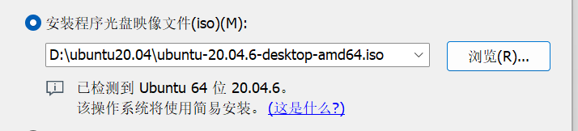
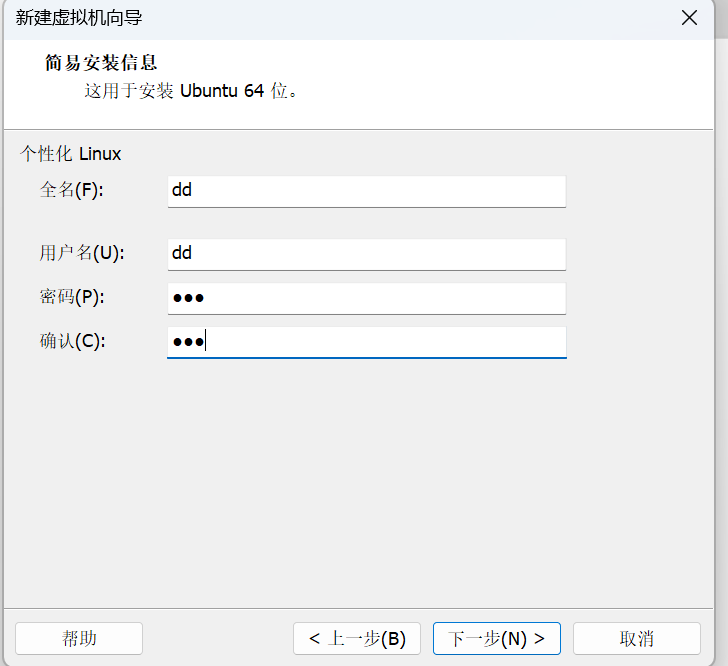

最新更新时间（2024-1-5）
*有关使用的readme在src文件夹下*
我尝试让这个项目在clone后就能直接使用，但目前还不行，不知道是什么原因（2024-1-4）

成功在一台电脑中移植此项目，下面是移植的具体流程：
*************************
物理机操作系统：windows11专业版
vmware版本：17pro
虚拟机系统：ubuntu20.04.6
使用文件文件名：ubuntu-20.04.6-desktop-amd64.iso
*************************
*******1.新建ubuntu虚拟机********
在vmware虚拟机中选择“新建虚拟机”，选择ubuntu20.04的iso文件并运行vmware的简易安装程序

在接下来的步骤中，将用户名和全名设置为dd

设置完安装路径后进入简易安装程序。
***2.安装ros，新建工作目录和进行第一次编译**
按照b站up@机器人工匠阿杰的ros教程，安装ros并且从github拉取rqt_robot项目
***3.拉取本项目**
在主目录下（绝对路径/home/dd）中新建文件夹ros_from_github，并在这个文件夹中clone本项目，将本项目src中所有文件（除CMakeLists.txt文件和隐藏文件）复制到位于主文件夹中catkin_ws/src/目录中，并在catkin_ws目录中执行命令catkin_make
将all.bag文件放在主目录中的catkin_ws文件夹内（就是你自建的工作空间）在执行source命令后，执行roslaunch ros_display_pkg ros_display.launch命令，发现项目正常运行。

