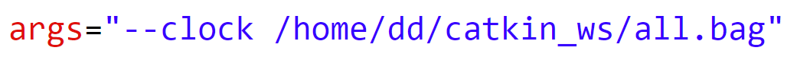

*******ros数据展示系统********
我在vmware上创建了ubuntu20.04虚拟机，并在这台虚拟机完成了项目的编写
使用docker的话这个项目应该也可以正常工作
*************************************************
确保你的ros1被正常安装，同时已经安装好opencv4.2.0、rviz1.14.20、gmapping（我在安装完ros1后opencv、rviz、gmapping都是安装好的）
****************************************************
项目中使用了rviz作为gmapping输出地图的显示，rviz的配置文件保存在ros_display_pkg/rviz目录下
****************************************************
仓库中有很多与展示系统无关的内容，都是我学习ros时编写的程序，大家可以忽略
******************************************************
与项目有关的pkg是这几个
depth_pkg 用于显示深度相机的数据

imu_pkg 用于显示imu数据（好像有点问题，显示roll有很长时间是-1）

learning_topic 用于显示色彩相机的数据，代码由github用户@ANDJO提供

odom 用于显示里程计数据，我画蛇添足给它添加了一个计算走过距离的功能，但是没有加消抖所以很不精确

pcl_display_pkg 用于显示点云地图，是我凌晨摁着gpt帮我写的，甚至还让gpt帮我把显示界面的背景色更改成白色了（快说 谢谢gpt）。代码里有很多被注释掉的内容，请务必忽略

ros_display_pkg 这个pkg中含有用来启动所有有关ros显示数据的节点的launch文件和rviz的配置文件。同时也可以用来启动all.bag文件。不过若是想要成功启动，需要修改launch文件第二行的args。

args=“--clock 这里改成你all.bag文件的具体路径”

这个launch文件同时还会启动gmapping节点和rviz，用于进行gmapping建图和建图的显示

*******项目推荐的使用方法*****
如果你直接去尝试执行ros_display_pkg那么很大概率会有各种报错
在这里推荐我学习的ros课程
b站bv号：BV1BP4y1o7pw

50节课看起来很多实际上一下就学完了（当然没有去学习他python部分的ros课程，这个老师每个项目都会用cpp和python实现一遍）认真学完可以对ros有一定的了解，并且学习到学习ros的方法（建议开倍速听课，碰到项目听完老师讲一遍自己写一遍效率最高）

这个项目肯定有很多不足，遇到问题的同学请务必来线下单杀我，大家轻喷qaqqqqq